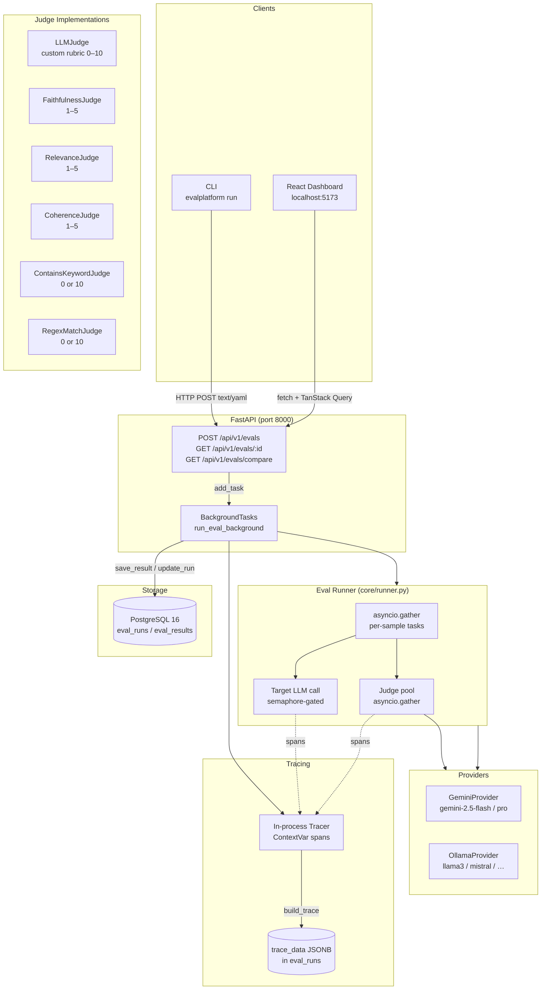

# LLM Eval Platform

> A full-stack platform for running, scoring, and comparing LLM outputs — with an interactive dashboard, CLI, and REST API.


---

## Table of Contents

- [Demo](#demo)
- [Screenshots](#screenshots)
- [Features](#features)
- [Architecture](#architecture)
- [Quickstart](#quickstart)
- [Eval Config Reference](#eval-config-reference)
- [Adding a New Provider](#adding-a-new-provider)
- [API Reference](#api-reference)
- [CLI Reference](#cli-reference)
- [Tech Stack](#tech-stack)
- [Live Demo](#live-demo)
- [Development](#development)
- [License](#license)

---

## Demo

https://github.com/user-attachments/assets/609643d7-5800-4bbf-a5cc-8b64fa22bd03

This demo runs the platform entirely on a local machine using [Ollama](https://ollama.com) — no cloud API keys required. If you just want to explore the UI without setting anything up, visit the live deployment link above.

Two evaluation configs from the `examples/` directory are used to compare how two different open-source models handle the same set of Python questions:

- **`compare_ollama_llama32.yaml`** — evaluates `ollama/llama3.2`
- **`compare_ollama_mistral.yaml`** — evaluates `ollama/mistral`

Both runs use **`ollama/llama3.1`** as the judge, selected because it is the strongest general-purpose model in the Ollama ecosystem and produces consistent, well-reasoned scores. Each run is scored across four dimensions: a custom accuracy rubric (0–10), Faithfulness, Relevance, and Coherence (1–5 each).

The models are tested against five Python questions covering concurrency, data structures, memory management, decorators, and async primitives. The full question set is in [`examples/dataset.jsonl`](examples/dataset.jsonl).

Once both runs complete, use the **Compare** feature in the dashboard to view a side-by-side breakdown of scores, per-sample responses, and judge reasoning — making it easy to see where one model outperforms the other.


---

## Screenshots

> **Dashboard — Eval List**
>
> 

> **Dashboard — Eval Detail (Overview tab)**
>
> 

> **Dashboard — Compare runs**
>
> 

---

## Features

- **Provider-agnostic** — evaluate against Gemini, Ollama, OpenAI-compatible, or any custom provider
- **LLM-as-judge** — score responses with structured rubrics via any supported model
- **Deterministic evaluators** — keyword and regex judges for fast, reproducible checks
- **Specialized judges** — built-in Faithfulness, Relevance, and Coherence judges with 1–5 scoring
- **Real-time progress** — live progress bar in the dashboard and CLI while runs execute
- **Full execution tracing** — every span (LLM call, judge execution) captured and visualized
- **Interactive dashboard** — compare runs, view trends over time, export results to CSV
- **CLI for automation** — submit, poll, compare, and list runs from the terminal or CI/CD

---

## Architecture



---

## Quickstart

### Prerequisites

- Python 3.12+
- Node 18+
- Docker (for PostgreSQL)
- A [Gemini API key](https://aistudio.google.com/app/apikey) (free tier works)

### 1. Clone and configure

```bash
git clone https://github.com/akshatkhosla/llm-eval-platform.git
cd llm-eval-platform
cp .env.example .env
# Edit .env and set your GEMINI_API_KEY
```

### 2. Start PostgreSQL

```bash
docker compose up -d
```

### 3. Install Python dependencies and migrate

```bash
python -m venv .venv
source .venv/bin/activate
pip install -e ".[dev]"
make migrate
```

### 4. Start the API server

```bash
make dev          # http://localhost:8000
                  # Auto-docs: http://localhost:8000/docs
```

### 5. Start the dashboard

```bash
cd dashboard
npm install
npm run dev       # http://localhost:5173
```

### 6. Run your first eval

```bash
# Via CLI (submits to API, polls until done, prints results table)
evalplatform run examples/sample_config.yaml --wait

# Or open http://localhost:5173 and click "New Eval"
```

---

## Eval Config Reference

Every eval is described by a YAML file with two top-level keys: `eval` and `providers`.

```yaml
eval:
  # Model to evaluate — format: "provider/model-name"
  model: gemini/gemini-2.5-flash-lite

  # Path to a .jsonl dataset (one JSON object per line)
  # Each row must have a "prompt" field; "expected" is optional
  dataset: data/dataset.jsonl

  # Seconds before a single LLM call times out
  timeout_seconds: 60

  # Maximum simultaneous LLM calls across all samples
  max_concurrency: 5

  judges:
    # ── LLM judge: scores 0–10 using a custom rubric ──────────────────
    - type: llm
      model: gemini/gemini-2.5-flash   # judge model (can differ from eval model)
      rubric: >
        Rate 0–10 how accurately the response answers the question.
        10 = completely correct and precise.
        0 = wrong, off-topic, or contradicts the question.

    # ── Faithfulness judge: is the output grounded in the reference? ──
    - type: faithfulness
      model: gemini/gemini-2.5-flash   # scores 1–5

    # ── Relevance judge: does the output address the question? ────────
    - type: relevance
      model: gemini/gemini-2.5-flash   # scores 1–5

    # ── Coherence judge: is the output logically structured? ──────────
    - type: coherence
      model: gemini/gemini-2.5-flash   # scores 1–5

    # ── Keyword check: deterministic pass/fail ────────────────────────
    - type: contains_keyword
      keyword: python
      case_sensitive: false            # 10 if found, 0 if not

    # ── Regex check: deterministic pass/fail ──────────────────────────
    - type: regex_match
      pattern: "\\b(def|class)\\b"     # 10 if matched, 0 if not

# Provider-level settings (optional — override defaults per provider)
providers:
  gemini:
    max_concurrency: 3   # cap concurrent Gemini API calls
  ollama:
    base_url: http://localhost:11434   # custom Ollama endpoint
    max_concurrency: 10
```

### Dataset format

Each line in the `.jsonl` file is a JSON object:

```jsonl
{"prompt": "What is Python?", "expected": "A high-level programming language."}
{"prompt": "Explain async/await", "expected": "A way to write asynchronous code."}
```

`expected` is optional. Judges that require a reference (e.g. FaithfulnessJudge) will skip scoring if it is absent.

---

## Adding a New Provider

1. **Create the implementation** in `src/evalplatform/core/providers/`:

```python
# src/evalplatform/core/providers/openai.py
import time
import httpx
from evalplatform.core.providers.base import LLMResponse

class OpenAIProvider:
    def __init__(self, model: str, api_key: str | None = None) -> None:
        import os
        self._model = model
        self._api_key = api_key or os.environ["OPENAI_API_KEY"]

    async def generate(
        self,
        prompt: str,
        system: str | None,
        temperature: float,
        max_tokens: int,
    ) -> LLMResponse:
        # ... call the OpenAI API ...
        return LLMResponse(
            text=response_text,
            input_tokens=usage["prompt_tokens"],
            output_tokens=usage["completion_tokens"],
            latency_ms=latency_ms,
            model=self._model,
            provider="openai",
        )

    @property
    def model(self) -> str:
        return self._model

    @property
    def provider(self) -> str:
        return "openai"
```

2. **Register it** in `src/evalplatform/core/providers/factory.py`:

```python
from evalplatform.core.providers.openai import OpenAIProvider

_PROVIDERS = {
    "gemini": GeminiProvider,
    "ollama": OllamaProvider,
    "openai": OpenAIProvider,   # add this line
}
```

3. **Use it** in your eval config:

```yaml
eval:
  model: openai/gpt-4o-mini
  ...
  judges:
    - type: llm
      model: openai/gpt-4o
      rubric: "Rate 0–10 ..."
```

That's it. The factory, runner, and dashboard will all pick it up automatically.

---

## API Reference

The FastAPI server exposes interactive Swagger docs at **`http://localhost:8000/docs`** and a ReDoc view at **`http://localhost:8000/redoc`**.

| Method | Path | Description |
|--------|------|-------------|
| `POST` | `/api/v1/evals` | Submit a YAML config and start a run (202) |
| `GET`  | `/api/v1/evals` | List runs (`?status=`, `?limit=`, `?offset=`) |
| `GET`  | `/api/v1/evals/{run_id}` | Get run details + aggregate scores |
| `GET`  | `/api/v1/evals/{run_id}/results` | Per-sample results (`?sort_by=score`) |
| `GET`  | `/api/v1/evals/{run_id}/traces` | Full span trace tree |
| `POST` | `/api/v1/evals/{run_id}/rerun` | Clone config and start a new run |
| `GET`  | `/api/v1/evals/compare` | Compare two runs (`?run_ids=uuid1,uuid2`) |
| `GET`  | `/health` | Health check |

### Submit via curl

```bash
curl -X POST http://localhost:8000/api/v1/evals \
  -H "Content-Type: text/yaml" \
  --data-binary @examples/sample_config.yaml
# → {"run_id": "...", "status": "pending"}
```

---

## CLI Reference

```
 Usage: evalplatform [OPTIONS] COMMAND [ARGS]...

 LLM Eval Platform CLI

╭─ Options ──────────────────────────────────────────────────────────────────╮
│ --help      Show this message and exit.                                    │
╰────────────────────────────────────────────────────────────────────────────╯
╭─ Commands ─────────────────────────────────────────────────────────────────╮
│ run       Submit an eval run from a YAML config file.                      │
│ status    Show run details with status, progress, and timestamps.          │
│ results   Show per-sample results for an eval run.                         │
│ compare   Compare two eval runs side by side.                              │
│ list      List recent eval runs.                                           │
╰────────────────────────────────────────────────────────────────────────────╯
```

**Examples:**

```bash
# Submit and wait for completion
evalplatform run examples/sample_config.yaml --wait

# Check status of a run
evalplatform status <run_id>

# View results as a table or raw JSON
evalplatform results <run_id>
evalplatform results <run_id> --format json | jq '.results[0]'

# Compare two runs
evalplatform compare <run_id_1> <run_id_2>

# List last 20 completed runs
evalplatform list --status completed --limit 20

# Point CLI at a remote server
EVALPLATFORM_API_URL=https://my-api.onrender.com evalplatform list
```

---

## Tech Stack

| Layer | Technology |
|-------|-----------|
| API server | FastAPI + Uvicorn |
| Database | PostgreSQL 16 + SQLAlchemy 2.0 async + asyncpg |
| Migrations | Alembic |
| Data validation | Pydantic v2 |
| LLM providers | Google Generative AI SDK (Gemini), httpx (Ollama) |
| CLI | Typer + Rich |
| Observability | In-process OpenTelemetry-style span tracer (stored as JSONB) |
| Dashboard | React 18 + Vite + TypeScript + Tailwind CSS |
| Data fetching | TanStack Query v5 |
| Tables | TanStack Table v8 |
| Charts | Recharts |
| Routing | React Router v6 |
| Linting | Ruff (lint + format) |
| Testing | pytest + pytest-asyncio |
| Deployment | Docker + Docker Compose + Render |

---

## Live Demo

| Service | URL |
|---------|-----|
| API (Render) | _Deploy in progress_ |
| Dashboard (Vercel) | _Deploy in progress_ |

---

## Development

```bash
make dev       # start API server (hot-reload)
make test      # run test suite
make lint      # ruff check + format check
make migrate   # apply Alembic migrations
```

### Environment variables

| Variable | Required | Default | Description |
|----------|----------|---------|-------------|
| `DATABASE_URL` | Yes | — | PostgreSQL connection string |
| `GEMINI_API_KEY` | Yes* | — | Google AI Studio API key (*required if using Gemini) |
| `DATASET_ROOT` | No | `data` | Root directory for dataset files (path traversal guard) |
| `EVALPLATFORM_API_URL` | No | `http://localhost:8000` | CLI target server URL |
| `ALLOWED_ORIGINS` | No | `*` | Comma-separated CORS origins for the API |

---

## License

MIT © 2024 Akshat Khosla
